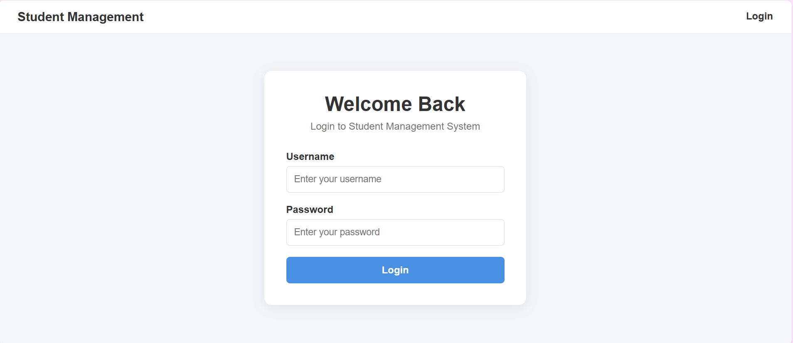
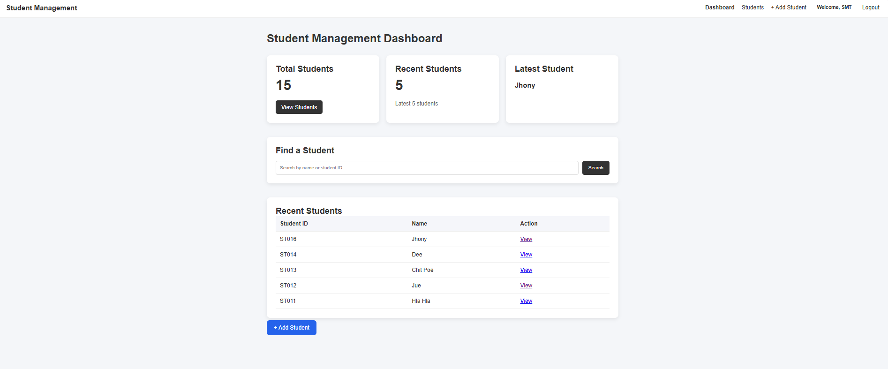
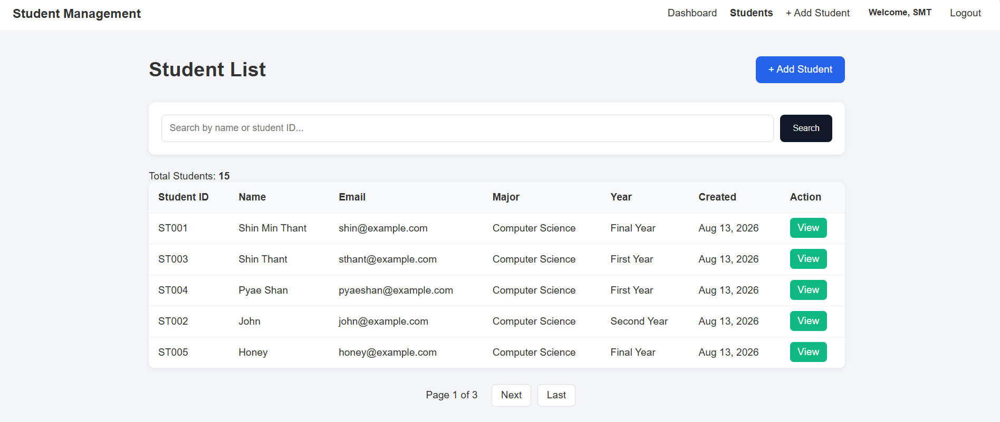
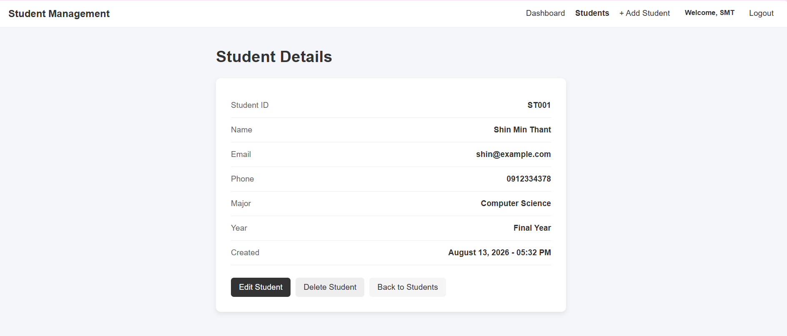

# Student Management System

A simple, responsive, and user-friendly Student Management System built with Django.

Live Demo: https://student-management-system-xu85.onrender.com/

## Features

* User Login and Logout
* Authentication-protected pages
* Dashboard
* Add Student
* View Student Details
* Edit Student
* Delete Student
* Search by Student Name or Student ID
* Student ID uniqueness validation
* Pagination
* Success and error messages
* Myanmar timezone support
* Responsive UI
* Clean and user-friendly design

## Technologies

### Backend

* Python
* Django 5.2

### Database

* SQLite

### Frontend

* HTML
* CSS
* Django Templates

### Tools

* Git
* GitHub
* Render

## Screenshots

### Login



### Dashboard



### Student List



### Student Detail



## Project Structure

```text
Student_Management_System/
│
├── manage.py
├── db.sqlite3
├── README.md
├── requirements.txt
├── screenshots/
│
├── student_management/
│   ├── settings.py
│   ├── urls.py
│   ├── wsgi.py
│   └── ...
│
└── students/
    ├── models.py
    ├── forms.py
    ├── views.py
    ├── urls.py
    │
    ├── management/
    │   └── commands/
    │       └── create_admin.py
    │
    ├── templates/
    │   └── students/
    │
    └── static/
        └── students/
            └── style.css
```

## Local Setup

### 1. Clone the repository

```bash
git clone https://github.com/ShinMinThant/Student_Management_System.git
cd Student_Management_System
```

### 2. Create a virtual environment

```bash
python -m venv .venv
```

### 3. Activate the virtual environment

Windows PowerShell:

```powershell
.venv\Scripts\Activate.ps1
```

### 4. Install dependencies

```bash
pip install -r requirements.txt
```

### 5. Run migrations

```bash
python manage.py migrate
```

### 6. Create the login user

```bash
python manage.py create_admin
```

### 7. Run the development server

```bash
python manage.py runserver
```

Open:

```text
http://127.0.0.1:8000/
```

## Authentication

The application uses Django's built-in authentication system.

Protected pages require users to log in before accessing student management features.

## Deployment

The application is deployed on Render.

Production configuration includes:

* `DEBUG=False`
* Configured `ALLOWED_HOSTS`
* Static file collection using `collectstatic`
* Gunicorn
* Environment-based Django secret key

## What I Learned

Through this project, I practiced:

* Django project and app structure
* Django models
* Model forms
* CRUD operations
* URL routing
* Django templates
* Template inheritance
* Authentication
* Login and logout
* Protected views
* Search and filtering
* Pagination
* Django messages
* Static files
* Git and GitHub
* Production deployment
* Render configuration
* Environment variables
* Deployment debugging

## Author

**Shin Min Thant**

Computer Science Student

GitHub:
https://github.com/ShinMinThant

## License

This project was created for learning and portfolio purposes.
